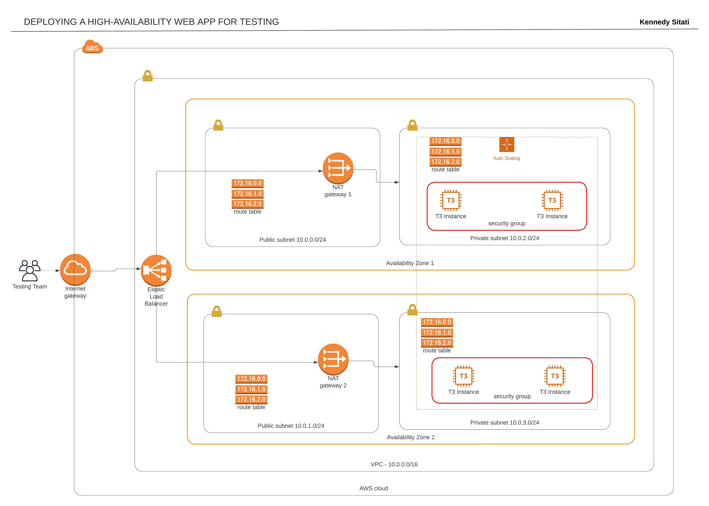

# Deploying a Web App using CloudFormation

## Project Overview

The project consist of using Cloudformation to create an infrastructure that is easy to spin up for either testing or production. It utilizes AWS Cloudformation ability to create infrastructure as a stack which can be easily created, deleted or updated in a few steps. The network infrastructure created includes a VPC, two public subnets, two private subnets with each having a NAT. The server infrastructure consist of Load Balancer for distribution of traffic, auto scaling group and security groups.

## Setup Environment

* Create [AWS Account](https://aws.amazon.com/free/).
* AWS CLI [install](https://docs.aws.amazon.com/cli/latest/userguide/cli-chap-getting-started.html) and [configure](https://docs.aws.amazon.com/cli/latest/userguide/cli-configure-quickstart.html)

### Optional

* Create [CircleCI Account](https://circleci.com/signup/).
* Guide on getting started with [CircleCi](https://circleci.com/docs/getting-started).
* Add Environment Variables in the CircleCi project for AWS_SECRET_KEY, AWS_REGION and AWS_ACCESS_KEY.

### Running the Application

* Go to [server deployment](cloudformation/server-deployment.yaml) file and change ImageId for a specific region.
* Go to [scripts](scripts/) and in both file change [region](https://docs.aws.amazon.com/AWSEC2/latest/UserGuide/using-regions-availability-zones.html#concepts-available-regions).
* Run the create-network.sh file and wait until it is finished (check in the AWS Cloudformation console) and then run create-server.sh
* Go to AWS Cloudformation console and find ServerStack, go to outputs to find the LoadBalancer url.

## Architecture

